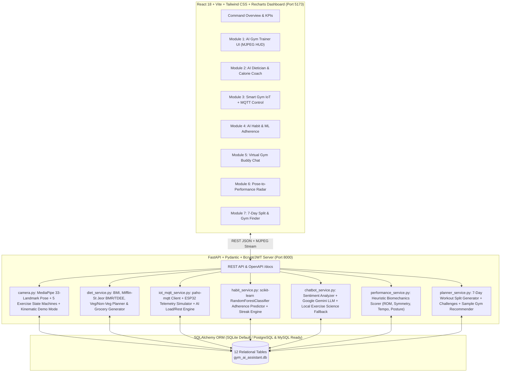

# AI Gym & Fitness Assistant

[](LICENSE)
[](backend/main.py)
[](camera.py)
[](backend/services/habit_service.py)
[](frontend/)

A complete, modular, runnable full-stack **AI Gym & Fitness Assistant** application. It integrates real-time computer vision pose estimation, nutritional biometrics, IoT MQTT equipment telemetry, machine-learning habit adherence prediction, sentiment-aware conversational coaching, biomechanical Pose-to-Performance scoring, and workout/gym planning into a unified dark-mode command center.

> **Open-Source Attribution**: Built upon [`saisanket232/AI_Gym_Fitness_Assistant`](https://github.com/saisanket232/AI_Gym_Fitness_Assistant) under the preserved [MIT License](LICENSE), upgraded from a prototype into a 7-module full-stack architecture on branch `feature/full-stack-ai-gym-assistant`.

---

## 1. System Architecture & 7 Core AI Modules



### Summary of All 7 Modules
1. **Module 1 — AI Gym Trainer (`camera.py`)**:
   - Real-time 33-landmark pose estimation using **OpenCV + MediaPipe Pose**.
   - Supports **5 exercises**: **Bicep Curl, Squat, Pushup, Lunge, and Shoulder Press**.
   - Computes 2D joint angles (`calculate_angle`), tracks left/right/total repetitions, estimates calories burned, and triggers real-time posture alerts (e.g., torso lean, hip sag, uneven shoulders, shallow squat depth).
   - **Automatic Demo Mode Fallback**: When no physical webcam is attached, synthesizes kinematic 33-landmark skeletons so the live video stream and rep counter work out-of-the-box on any machine.
2. **Module 2 — AI Dietician & Calorie Coach (`backend/services/diet_service.py`)**:
   - Calculates BMI, category, **Mifflin-St Jeor BMR**, and activity-adjusted **TDEE**.
   - Generates structured **Vegetarian** and **Non-Vegetarian** daily meal plans with macro breakdowns (Protein, Carbs, Fats), daily food logger, and categorized weekly grocery lists.
   - *Transparency Note*: All calorie and nutrition values are clearly labeled as algorithmic estimates, not medical diagnoses.
3. **Module 3 — Smart Gym Assistant (`backend/services/iot_mqtt_service.py`)**:
   - Integrates `paho-mqtt` (`SmartGymIoTManager`) and defines an ESP32 hardware topic/payload contract (`gym/equipment/<device_id>/telemetry`).
   - Provides **4 interactive simulated smart gym devices** (Smart Dumbbell, Digital Cable Tower, Incline Treadmill, Optical HR Strap) clearly labeled as **Simulation Mode** when physical hardware is absent.
   - AI rule engine recommends next-set resistance adjustments (`kg`) and recovery rest intervals (`sec`) from live heart rate and rep velocity.
4. **Module 4 — AI Fitness Habit Tracker (`backend/services/habit_service.py`)**:
   - Tracks daily workout check-ins, current/longest streaks, missed sessions, and 14-day consistency percentage.
   - Trains a **`scikit-learn` `RandomForestClassifier`** on a disclosed 500-sample synthetic behavioral adherence dataset (`age`, `sleep_hours`, `stress_level`, `work_hours`, `motivation_level`, `prev_days_active`, `water_liters`) to predict workout completion probability and suggest adaptive schedule adjustments.
5. **Module 5 — Virtual Gym Buddy (`backend/services/chatbot_service.py`)**:
   - Multi-turn conversational fitness coach with real-time **sentiment & mood tagging** (`Motivated`, `Fatigued / Sore`, `Stressed`, `Curious`).
   - Powered by **Google Gemini (`GEMINI_API_KEY` / `gemini-2.0-flash`)** via `.env` and automatically falls back to a comprehensive local exercise-science knowledge engine when no API key is configured.
6. **Module 6 — Pose-to-Performance Analyzer (`backend/services/performance_service.py`)**:
   - Evaluates **Range-of-Motion (ROM) efficiency (35%)**, **Posture & Alignment accuracy (30%)**, **Bilateral Left/Right symmetry (20%)**, and **Repetition Tempo consistency (15%)** to compute a transparent **0–100 Performance Score** (clearly labeled as a non-clinical heuristic).
7. **Module 7 — Gym Recommender & Planner (`backend/services/planner_service.py`)**:
   - Generates custom **7-day workout splits** tailored to goal, experience level, equipment access, and training frequency.
   - Includes a searchable exercise catalog, gamified fitness challenges, and a **Nearby Gym Finder** with city/facility filtering (clearly labeled as **Sample Demo Data** when no external Places API key is provided).

---

## 2. Database Schema (12 SQLAlchemy Tables)

Defined in [`backend/models.py`](backend/models.py) and auto-seeded via [`backend/seed.py`](backend/seed.py):
1. `users` — Account credentials (`bcrypt` password hashes, age, gender)
2. `fitness_profiles` — Height, weight, target weight, fitness goal, dietary preference, equipment, schedule
3. `bmi_records` — Historical BMI, BMR, and TDEE calculations
4. `workout_plans` — Generated 7-day workout splits and challenges JSON
5. `workout_sessions` — Logged computer-vision trainer sessions, reps, duration, calories, and posture notes
6. `diet_plans` — Generated Vegetarian/Non-Vegetarian meal plans and grocery lists
7. `nutrition_logs` — Daily meal and macro intake tracker records
8. `chat_messages` — Multi-turn Virtual Gym Buddy conversation history with sentiment & mood tags
9. `habit_logs` — Daily workout check-ins, sleep, stress, hydration, and ML adherence probabilities
10. `performance_reports` — Session-level Pose-to-Performance biomechanical breakdowns
11. `iot_devices` — Smart Gym MQTT equipment state and last telemetry snapshots
12. `gym_locations` — Sample nearby gym directory with ratings, facilities, and coordinates

---

## 3. Step-by-Step Windows Setup & Run Guide

### Option A: One-Click Windows Launch
Double-click [`run.bat`](run.bat) or run from PowerShell:
```powershell
.\run.bat
```

### Option B: Manual Terminal Commands (Verified)

#### 1. Configure Environment Variables
```powershell
Copy-Item .env.example .env
```
*(Optional: Add `GEMINI_API_KEY` in `.env` for live Google Gemini LLM chat; all modules work out-of-the-box without any paid keys).*

#### 2. Activate Virtual Environment & Start FastAPI Backend (Port 8000)
```powershell
.\venv\Scripts\python.exe app.py
```
- **Backend API**: `http://127.0.0.1:8000`
- **Interactive Swagger / OpenAPI Documentation**: `http://127.0.0.1:8000/docs`
- **Default Demo Login Credentials**: `alex@ironclad.ai` / `Fitness@123`

#### 3. Start React + Vite Frontend Dashboard (Port 5173)
Open a second PowerShell terminal:
```powershell
cd frontend
npm install
npm run dev
```
- **Frontend UI**: `http://localhost:5173`

---

## 4. Running Automated Tests (`pytest`)

```powershell
.\venv\Scripts\python.exe -m pytest tests/test_api.py -v
```
Verifies health checks, JWT authentication, profile updates, joint-angle math, 5-exercise computer vision state machines, diet generation, IoT MQTT simulation, `scikit-learn` adherence prediction, chatbot fallback, Pose-to-Performance scoring, and 7-day split/gym recommendations.

---

## 5. License

This project preserves the original **MIT License** from `saisanket232/AI_Gym_Fitness_Assistant`. See [`LICENSE`](LICENSE) for full details.
