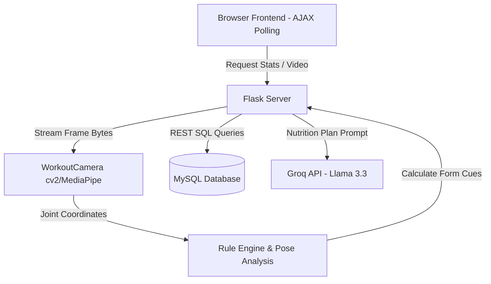
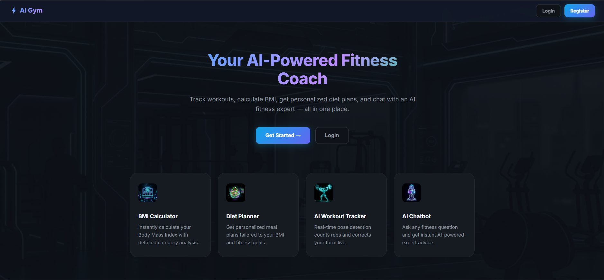
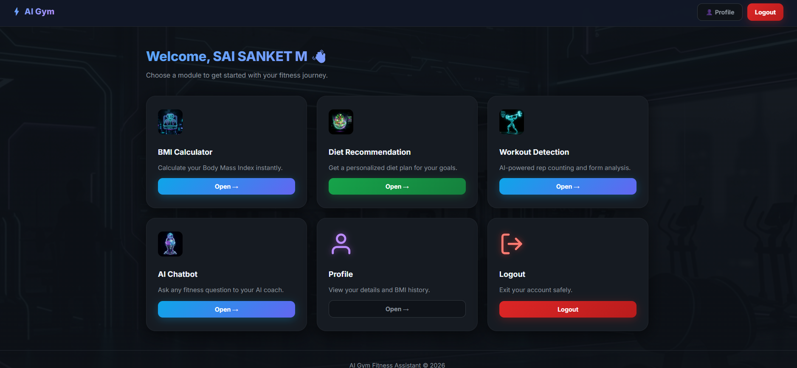
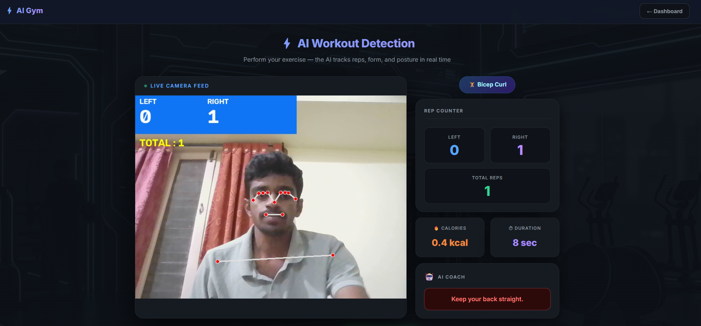
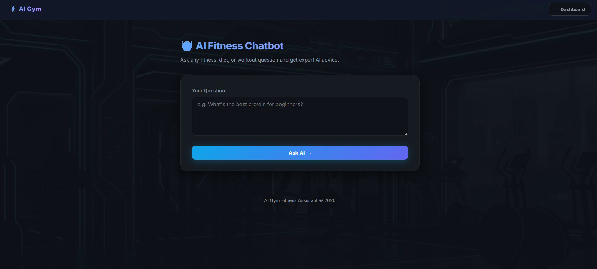

# 🏋️ AI Gym Fitness Assistant

An AI-powered fitness web application built with Flask, MediaPipe, OpenCV, MySQL, and Groq LLM for real-time workout tracking, posture analysis, personalized diet recommendations, and AI-powered fitness coaching.

This system tracks workout form in real time, recommends personalized nutrition plans, provides AI-powered posture feedback, stores workout history, and serves users through a responsive dark-mode interface.

---

## 🚀 System Architecture & Implementation

The application is built on a split-service architecture designed for real-time video streaming, high-throughput database operations, and low-latency API communication.



### 1. Modular AI Models
The intelligence is decoupled into three modular subsystems:
*   **Workout Form Detection (`camera.py`)**: Powered by a custom **MediaPipe Pose** model and **NumPy** geometric rule engine. It tracks 33 critical landmarks, calculates dual-arm elbow angles, wrist alignments (`ELBOW` → `WRIST` → `INDEX`), shoulder symmetry, and back leaning indices. A priority-driven logical router evaluates these vectors and provides live coaching feedback.
*   **Diet Recommendation Module (`app.py`)**: Dynamically aligns nutrition plans with physical categories. Calculates Body Mass Index (BMI) using clean formula rules and pairs results with distinct macro-nutrient profiles (e.g., protein, low carb, sage/mint balance) mapped persistently in database logs.
*   **Workout History & Analytics**

Stores workout sessions including exercise type, left/right repetitions, total repetitions, calories burned, and workout duration for future analytics and progress tracking.

### 2. Integration Layer & Backend REST APIs
*   `GET /video_feed`: Streams processed frame byte arrays as `multipart/x-mixed-replace` boundaries directly to browser image components.
*   `GET /workout_stats`: Serves live JSON data (reps, angles, calories, duration, custom coach feedback alerts) consumed via client-side AJAX polling intervals.
*   `GET /finish_workout`: Commits physical session performance, total reps, session length, and calories directly to the relational database, resetting camera states cleanly.

### 3. Database Schema Layout
The application uses five relational MySQL tables:
*   `users`: Stores credential verification hashes (`bcrypt`).
*   `bmi_history`: Stores chronological height, weight, and BMI categories.
*   `diet_history`: Stores custom nutritional diet guidelines linked to BMI.
*   `chatbot_history`: Stores persistent chat dialogue histories.
*   `workout_history`: Tracks exercise, rep counts, duration, and calorie telemetry.

---
## Tech Stack

### Backend

- Flask
- Python

### Database

- MySQL

### AI & Computer Vision

- MediaPipe
- OpenCV
- Groq Llama 3.3

### Frontend

- HTML
- CSS
- Bootstrap
- JavaScript

### Libraries

- NumPy
- bcrypt

---
## Project Structure

```text
AI_Gym_Fitness_Assistant/

app.py

camera.py

config.py

templates/

static/

requirements.txt

README.md
```

---
## Prerequisites

- Python 3.10+
- MySQL Server
- Webcam
- Groq API Key

---
## 🛠️ Installation & Setup

### 1. Clone & Setup Environment
Ensure Python 3.8+ and MySQL Server are installed.
```bash
# Set up virtual environment
python -m venv venv
source venv/bin/activate  # On Windows: venv\Scripts\activate

# Install dependencies
pip install -r requirements.txt
```

### 2. Database Initialization
Ensure a MySQL server instance is running on `localhost:3306` with a database named `gym_ai_assistant` and standard user credentials. Run the following schemas:
```sql
CREATE DATABASE IF NOT EXISTS gym_ai_assistant;
USE gym_ai_assistant;

CREATE TABLE IF NOT EXISTS users (
    user_id INT AUTO_INCREMENT PRIMARY KEY,
    name VARCHAR(100),
    email VARCHAR(100) UNIQUE,
    password VARCHAR(255),
    age INT,
    gender VARCHAR(20)
);

CREATE TABLE IF NOT EXISTS bmi_history (
    bmi_id INT AUTO_INCREMENT PRIMARY KEY,
    user_id INT,
    height FLOAT,
    weight FLOAT,
    bmi FLOAT,
    category VARCHAR(50),
    FOREIGN KEY(user_id) REFERENCES users(user_id)
);

CREATE TABLE IF NOT EXISTS diet_history (
    diet_id INT AUTO_INCREMENT PRIMARY KEY,
    user_id INT,
    category VARCHAR(50),
    diet_plan TEXT,
    FOREIGN KEY(user_id) REFERENCES users(user_id)
);

CREATE TABLE IF NOT EXISTS chatbot_history (
    chat_id INT AUTO_INCREMENT PRIMARY KEY,
    user_id INT,
    question TEXT,
    answer TEXT,
    FOREIGN KEY(user_id) REFERENCES users(user_id)
);

CREATE TABLE IF NOT EXISTS workout_history (
    workout_id INT AUTO_INCREMENT PRIMARY KEY,
    user_id INT,
    exercise VARCHAR(100),
    left_reps INT,
    right_reps INT,
    total_reps INT,
    duration INT,
    calories_burned FLOAT,
    FOREIGN KEY(user_id) REFERENCES users(user_id)
);
```

### 3. Set API Credentials
Create a `.env` file in the root folder:
```env
GROQ_API_KEY=your_groq_api_key_here
```

### 4. Run Server
```bash
python app.py
```
Go to `http://127.0.0.1:5000` to interact with the application.

---
## Screenshots

### Home Page



### Dashboard



### Workout Detection



### AI Chatbot



---

## 📊 Verification & Testing Report

| Module | Test Scenario | Expected Result | Actual Result | Status |
| :--- | :--- | :--- | :--- | :--- |
| **Authentication** | Sign up new user and login | Hash matching via Bcrypt, grant Flask session | Passwords securely verified | **Passed** |
| **BMI Calculator** | Height = 175cm, Weight = 70kg | Calculates BMI ~22.86, inserts "Normal" to DB | Correct math & database commit | **Passed** |
| **Pose Detection** | Open workout module | Open Camera stream overlaying skeleton lines | Instant, low-latency rendering | **Passed** |
| **Coaching Engine** | Lean forward or bend wrist | UI displays warnings: "Keep back straight" / "Keep wrist straight" | Priority flags trigger warn states | **Passed** |
| **Webcam Release** | Navigate away from workout screen | Generator exits, dynamic `VideoCapture.release()` frees hardware | Webcam turns off instantly | **Passed** |
| **Chat Assistant** | Ask fitness query | Queries Llama 3.3 on Groq, returns relevant tips | Accurate assistant replies | **Passed** |
| **Finish Session** | Click Finish Workout button | Commit reps, calories, and duration, then clear capture state | Logged to database, state resets | **Passed** |

---
## ✨ Features

- 🔐 User Authentication
- 📏 BMI Calculator
- 🥗 Personalized Diet Recommendation
- 🤖 AI Chatbot (Groq LLM)
- 🎥 Live Workout Detection
- 🧍 AI Posture Feedback
- 💪 Dual Arm Rep Counter
- 📊 Workout History
- 📡 Live Video Streaming
- 🗄️ MySQL Database Integration
- 🌐 REST APIs
---


## 📈 Future Enhancements
*   **Predictive Performance Curves**: Introduce regression models predicting weight overload risks based on rep velocity fatigue.
*   **Time-Series Progress Charts**: Build SVG dashboard charts highlighting calories burned and duration curves across consecutive weeks.
*   **Multi-Exercise Classifier**: Extend MediaPipe landmark sequences using LSTM models to dynamically recognize Squats, Lunges, and Shoulder Presses.


## License

This project is licensed under the MIT License.
